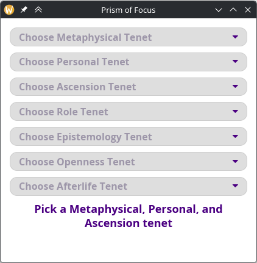
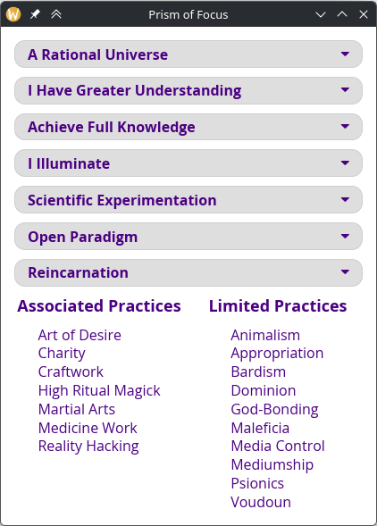
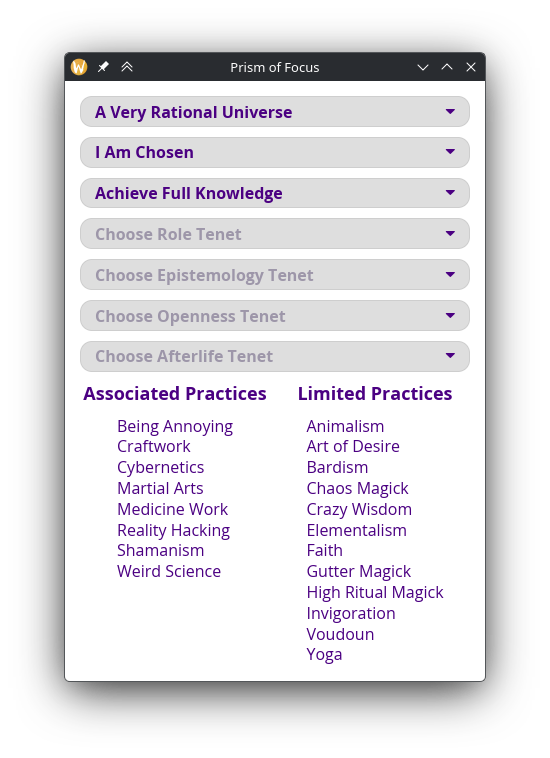

# Prism of Focus Companion
This is an unofficial companion for [Charles Siegel's](https://www.patreon.com/charlessiegel) [Prism Of Focus](https://www.drivethrurpg.com/en/product/446015/prism-of-focus) supplement for Mage the Ascension 20th Anniversary edition. It is used to automatically calculate Associated and Limited tenets for any Paradigm.

All tenets are defined in a tenets.json file and read at runtime. Thus tenets.json must be in the same directory as the executable.


## Running Example





## Customizing Tenets
As the tenet information is stored in tenets.json, you can add additional tenets to existing categories or modify existing tenets.

By changing:
```json
{
    "name": "A Rational Universe",
    "associated_practices": [
    "Cybernetics",
    "Reality Hacking",
    "Alchemy",
    "Hypertech",
    "Craftwork"
    ],
    "limited_practices": [
    "Voudoun",
    "Crazy Wisdom",
    "Witchcraft",
    "Gutter Magick",
    "Chaos Magick"
    ]
}
```

to:

```json
{
    "name": "A Very Rational Universe",
    "associated_practices": [
    "Being Annoying",
    "Cybernetics",
    "Reality Hacking",
    "Alchemy",
    "Hypertech",
    "Craftwork"
    ],
    "limited_practices": [
    "Voudoun",
    "Crazy Wisdom",
    "Witchcraft",
    "Gutter Magick",
    "Chaos Magick"
    ]
}
```

We are able to change the tenet without recompiling the app.




## Installation
The program has been compiled for Windows and Linux. Windows requirements is Windows 10. Linux requirement is glibc >= 2.39.

Precompiled binaries can be installed from [releases](https://github.com/Rhinemann/Prism-of-Focus/releases) tab and ready to run once uncompressed.


## Compilation
In case want to compile the app yourself you may do so using
```sh
cargo build
```
command.


## Future Plans
Additions considered for future releases:
- [ ] Custom tenet categories.
- [ ] Browsable practice database with Instruments, Resonance traits and minimal necessary information.
